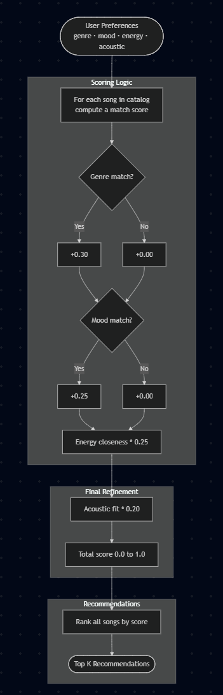
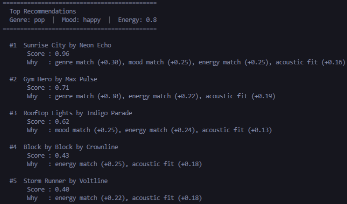
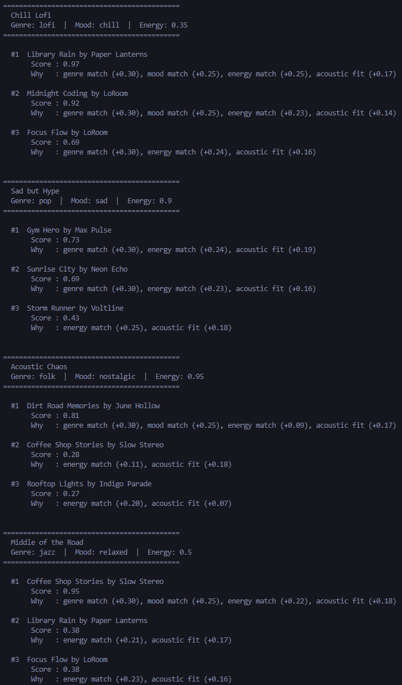

# 🎵 Music Recommender Simulation

## Project Summary

In this project you will build and explain a small music recommender system.

Your goal is to:

- Represent songs and a user "taste profile" as data
- Design a scoring rule that turns that data into recommendations
- Evaluate what your system gets right and wrong
- Reflect on how this mirrors real world AI recommenders

Real-world recommenders like Spotify or YouTube learn from massive behavioral datasets (plays, skips, likes) to determine what a user wants next. My version focuses in the core functions: instead of learning from behavior, my recommender define a user's taste explicitly through a profile (preferred genre, mood, energy level, and acoustic preference), then score every song by how closely it matches. This makes the system transparent and easy to trace, at the cost of personalization depth. The priority here is interpretability and correctness of the scoring logic over scale or surprise.

## How The System Works

**What features does each `Song` use?**

Each song carries four attributes used in scoring: `genre` and `mood` (categorical) act as the primary filters, while `energy` and `acousticness` (both 0.0 to 1.0) fine-tune the match. The remaining fields (`valence`, `danceability`, `tempo_bpm`) are stored on the song but not yet factored into the score.

**What does the `UserProfile` store?**

The user is represented as a static taste profile with four fields that mirror the song attributes used in scoring:

```python
user_prefs = {
    "genre": "pop",
    "mood": "happy",
    "energy": 0.8,
    "likes_acoustic": False
}
```

**How does the `Recommender` compute a score?**

For each song, it adds up weighted points based on how well the song matches the profile:

| Rule                                                | Weight |
| --------------------------------------------------- | ------ |
| Genre matches user's preferred genre                | 0.30   |
| Mood matches user's preferred mood                  | 0.25   |
| `(1 - abs(song.energy - user.energy))`              | 0.25   |
| Acoustic fit (`acousticness` or `1 - acousticness`) | 0.20   |

**How are songs chosen?**

All songs are scored, sorted in descending order, and the top `k` (default 5) are returned along with a short explanation of why each one ranked where it did.

**Potential biases to expect**

Genre carries the single largest weight (0.30), so a song that perfectly matches mood, energy, and acousticness but differs in genre will almost always lose to a genre-match with weaker other scores. The system may also under-serve users whose taste crosses genre lines, since it treats genre as a binary yes/no rather than a spectrum.
**Diagram**



**Output**



**More profiles**



## Getting Started

### Setup

1. Create a virtual environment (optional but recommended):

    ```bash
    python -m venv .venv
    source .venv/bin/activate      # Mac or Linux
    .venv\Scripts\activate         # Windows

    ```

2. Install dependencies

```bash
pip install -r requirements.txt
```

3. Run the app:

```bash
python -m src.main
```

### Running Tests

Run the starter tests with:

```bash
pytest
```

You can add more tests in `tests/test_recommender.py`.

---

## Experiments You Tried

Seven user profiles were tested in total. Three were straightforward (High-Energy Pop, Chill Lofi, Deep Intense Rock). Four were designed to break or stress the system.

**Sad but Hype:** genre=pop, mood=sad, energy=0.9. No pop/sad song exists in the catalog, so the mood weight was always wasted. The top result had no mood match at all.

**Ghost Genre:** genre=metal, which is not in the catalog. The system fell back to mood and energy only. Every song scored at most 0.69 instead of the usual 0.94+.

**Acoustic Chaos:** genre=folk, mood=nostalgic, energy=0.95. Folk songs are naturally low energy, so the system recommended a song that matched genre and mood but directly contradicted the energy target. Genre and mood won over energy.

**Middle of the Road:** genre=jazz, energy=0.5. One perfect match scored 0.95, then second place dropped to 0.38. Having only one jazz song in the catalog made the results very uneven.

---

## Limitations and Risks

- Genre is the biggest single weight. A song from the wrong genre will almost always lose, even if everything else matches.
- If a genre or mood is not in the catalog, those weights are wasted. A user looking for metal or country gets nothing useful.
- The catalog only has 15 songs. Results are heavily shaped by which genres have more entries — lofi users get 3 matches, most others get 1.
- Tempo, valence, danceability, and lyrics are ignored. Two songs in the same genre can sound completely different and still score the same.
- The system treats every user with the same fixed weights. Someone who cares a lot about energy but not genre has no way to say that.

---

## Reflection

[**Model Card**](model_card.md)

Write 1 to 2 paragraphs here about what you learned:

Building this made it clear how much a recommender depends on its data, not just its logic. The scoring rules made sense on paper, but the results were only as good as the catalog behind them. A user looking for metal or country got nothing useful, not because the algorithm was wrong, but because those genres simply were not there.

The most surprising result came from the Acoustic Chaos profile. The system recommended a folk song to a user who wanted high energy, just because genre and mood matched. It was technically correct by the scoring rules, but it is wrong. That gap between "correct by the formula" and "actually useful" is probably the most important thing from the project. Real recommenders have to deal with that gap at a much larger scale.

## 7. `model_card_template.md`

Combines reflection and model card framing from the Module 3 guidance. :contentReference[oaicite:2]{index=2}

```markdown
# 🎧 Model Card - Music Recommender Simulation

## 1. Model Name

Give your recommender a name, for example:

> VibeFinder 1.0

---

## 2. Intended Use

- What is this system trying to do
- Who is it for

Example:

> This model suggests 3 to 5 songs from a small catalog based on a user's preferred genre, mood, and energy level. It is for classroom exploration only, not for real users.

---

## 3. How It Works (Short Explanation)

Describe your scoring logic in plain language.

- What features of each song does it consider
- What information about the user does it use
- How does it turn those into a number

Try to avoid code in this section, treat it like an explanation to a non programmer.

---

## 4. Data

Describe your dataset.

- How many songs are in `data/songs.csv`
- Did you add or remove any songs
- What kinds of genres or moods are represented
- Whose taste does this data mostly reflect

---

## 5. Strengths

Where does your recommender work well

You can think about:

- Situations where the top results "felt right"
- Particular user profiles it served well
- Simplicity or transparency benefits

---

## 6. Limitations and Bias

Where does your recommender struggle

Some prompts:

- Does it ignore some genres or moods
- Does it treat all users as if they have the same taste shape
- Is it biased toward high energy or one genre by default
- How could this be unfair if used in a real product

---

## 7. Evaluation

How did you check your system

Examples:

- You tried multiple user profiles and wrote down whether the results matched your expectations
- You compared your simulation to what a real app like Spotify or YouTube tends to recommend
- You wrote tests for your scoring logic

You do not need a numeric metric, but if you used one, explain what it measures.

---

## 8. Future Work

If you had more time, how would you improve this recommender

Examples:

- Add support for multiple users and "group vibe" recommendations
- Balance diversity of songs instead of always picking the closest match
- Use more features, like tempo ranges or lyric themes

---

## 9. Personal Reflection

A few sentences about what you learned:

- What surprised you about how your system behaved
- How did building this change how you think about real music recommenders
- Where do you think human judgment still matters, even if the model seems "smart"
```
